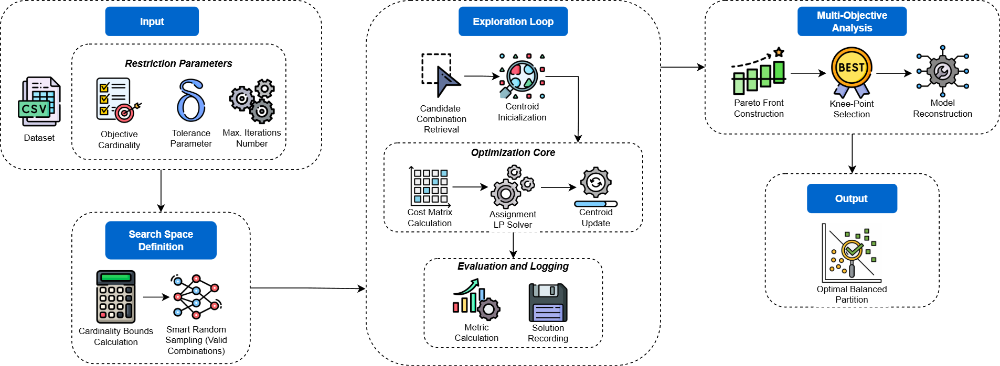

## Semi-Supervised Soft Clustering with Flexible Cardinality 

## Overview

This repository contains the implementation of **CapFlex**, a semi-supervised clustering framework proposed in the paper *"Semi-Supervised Soft Clustering with Flexible Cardinality"*.

Clustering under size requirements is critical in operational settings (e.g., workload distribution, territorial partitioning) but is often hindered by rigid constraints that overrule data similarity. **CapFlex** treats target cluster sizes as *soft* requirements by allowing bounded deviations around an ideal cardinality vector.

Key features:
* **Flexible Constraints:** Allows defined tolerance margins ($\delta$) around target sizes instead of strict equality.
* **Hybrid Optimization:** Combines stochastic exploration of feasible cardinality vectors with an exact Mixed-Integer Linear Programming (MILP) assignment step.
* **Pareto Optimization:** Balances the trade-off between structural quality (Silhouette) and cardinality compliance.

## Methodology
The proposed approach uses a two-level algorithm. The outer level performs a bounded exploration of the cardinality search space (using Random Search), while the inner level solves the optimal assignment problem for each candidate capacity vector using MILP.


*Figure 1: The CapFlex framework architecture, illustrating the coupling of stochastic capacity exploration with MILP-based assignment optimization.*

## Notation

| Symbol | Description |
|---|---|
| $\mathcal{D}$ | Dataset. |
| $n$ | Total number of instances in the dataset. |
| $k$ | Number of *clusters*. |
| $x_j$ | $j$-th instance in the dataset. |
| $C$ | Set of *clusters*. |
| $C_i$ | Resulting cardinality of *cluster* $i$. |
| $c$ | Set of centroids. |
| $E$ | Vector of target size constraints. |
| $E_i$ | Exact cardinality for *cluster* $i$. |
| $L_i, U_i$ | Allowed bounds for the size of *cluster* $i$. |
| $Z_{ij}$ | Binary decision variable. |
| $\delta$ | Flexible tolerance coefficient. |
| $\mathcal{H}$ | Historical set of evaluated candidate solutions. |
| $\mathcal{P}$ | Pareto front containing the non-dominated solutions. |
| $J$ | Objective function representing the total dissimilarity cost. |
| $S$ | Computed Silhouette coefficient. |
| $V$ | Cardinality Violation Index (CSVI). |
| $Z$ | Binary assignment matrix. |
| $\mathcal{E}$ | Set of feasible cardinalities. |
| $r$ | Remaining instances to be assigned in the recursion. |
| $R_{min}, R_{max}$ | Lower and upper pruning bounds for future *clusters*. |
| $v$ | Candidate cardinality of the current *cluster*. |
| $d_{ij}$ | Dissimilarity between instance $x_j$ and the centroid of *cluster* $i$. |
| $\epsilon$ | Centroid convergence threshold. |

## Summary of evaluation datasets

| ID | Dataset Name | #Instances | #Vars. | #Clusters | Cluster Sizes |
|---|---|---:|---:|---:|---|
| 1 | Iris | 150 | 4 | 3 | [50, 50, 50] |
| 2 | Heart Disease | 1025 | 14 | 2 | [499, 526] |
| 3 | Obesity Levels | 2111 | 17 | 7 | [272, 287, 351, 297, 324, 290, 290] |
| 4 | Glass Identification | 214 | 9 | 6 | [70, 76, 17, 13, 9, 29] |
| 5 | Breast Cancer Wisconsin | 568 | 30 | 2 | [356, 212] |
| 6 | Engineering Salary | 2998 | 34 | 2 | [226, 2772] |
| 7 | Water Probability | 3276 | 10 | 2 | [1998, 1278] |
| 8 | Cure The Princess | 2338 | 14 | 2 | [1177, 1161] |
| 9 | AIDS Clinical | 2139 | 24 | 2 | [1618, 521] |
| 10 | Migration Mexico-USA | 2443 | 10 | 6 | [330, 593, 392, 93, 162, 873] |
| 11 | Bank Loan Approval | 5000 | 14 | 2 | [4520, 480] |
| 12 | Wine Quality | 6497 | 13 | 2 | [1599, 4898] |
| 13 | Clustering of Cycling | 4435 | 11 | 9 | [1399, 312, 467, 356, 290, 549, 503, 185, 374] |
| 14 | Turkiye Student Evaluation | 5820 | 33 | 3 | [775, 1444, 3601] |
| 15 | Abalone | 4177 | 8 | 3 | [1307, 1342, 1528] |

## Installation
This project is written in **R**. To replicate the experiments, you need a working R environment (version 4.0.0 or higher is recommended).

### Prerequisites

* **R**: Download from [CRAN](https://cran.r-project.org/).
* **RStudio** (Optional but recommended).

### Dependencies
```r
install.packages(c(
  "foreach",     
  "doParallel",  
  "lpSolve",     
  "readr",       
  "dplyr",       
  "aricode",     
  "cluster"
```
## Usage

### 1. Running the Analysis

The main script is designed to be executed either from the command line or interactively within RStudio.

**Option A: Command Line**

To run the complete pipeline using `Rscript`:

```bash
Rscript CapFlex.R
```

**Option B: RStudio**

1. Open the project in RStudio.
2. Open the `CapFlex.R` script.
3. Adjust the parameters at the beginning of the file to select the dataset or tolerance.
4. Click the **Source** button to run the complete pipeline.
